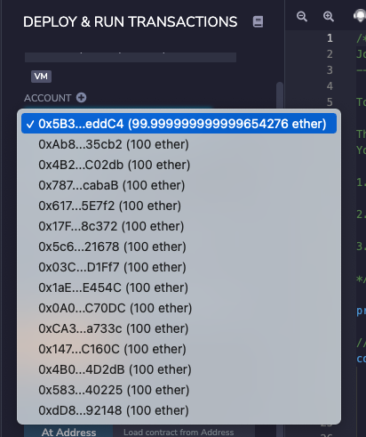
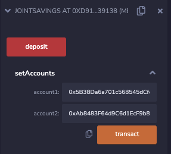
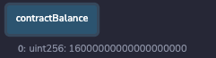
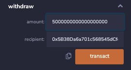
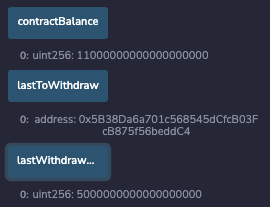
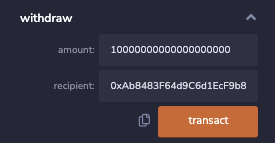
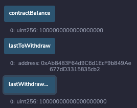
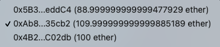

# JointSavings

## To run the program: 

Source code: joint_saving.sol

run this code in the Remix IDE

The program will create a Solidity smart contract to accept two user addresses and provide the features (deposit and withdraw funds) as an joint savings account.
 
 
## To test the program:

### 1. set accounts
get the addresses from JavaScriptVM (London) for account1 and account2
 
 
account1 address: 0x5B38Da6a701c568545dCfcB03FcB875f56beddC4
 
account2 address: 0xAb8483F64d9C6d1EcF9b849Ae677dD3315835cb2
 
 

enter the addresses of account1 and account2 in the setAccounts

 
 
### 2. deposit funds

use the deposit fuction to deposit 1, 10, 5 ethers from account1

 
Here is the contract balance after the deposits.
 

 
 
### 3. withdraw funds
withdraw 5 ether into account1
 

 
Here is the information of contract balance, lastToWithdraw, and lastWithdrawAmount aftere the withdraw.
 

 
 
withdraw 10 ether into account2
 

 
Here is the information of contract balance, lastToWithdraw, and lastWithdrawAmount aftere the withdraw.
 

 
 
The ending balances of account1 and account2
 

